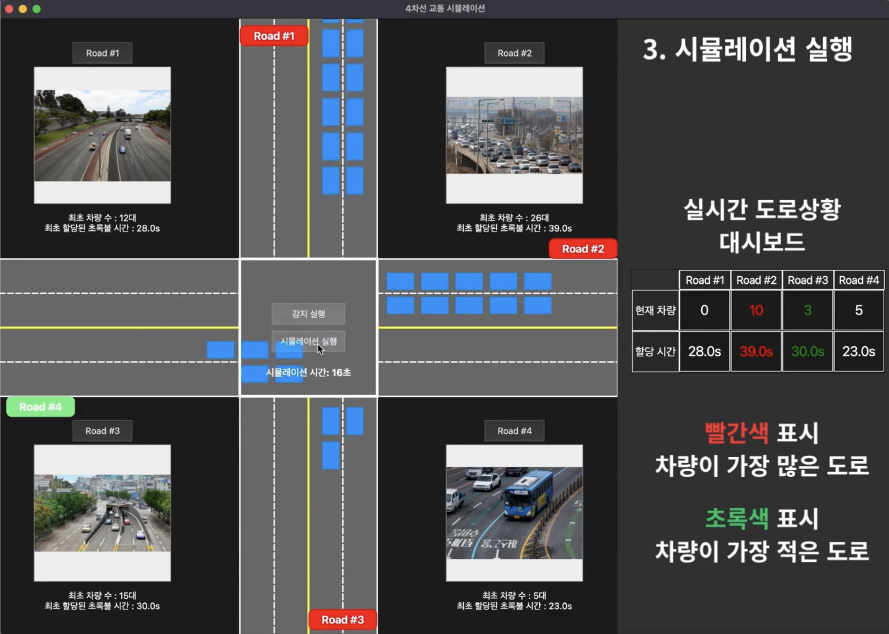

# Flexible Traffic System
### SW Pilot 파이썬 과정 파이썬 5팀 (팀명 : 신(新)호등)
* AI 기반의 유동적인 신호등 시스템을 구축을 목표로 하는 프로젝트




## Get Started

### Installation

1. Clone FlexibleTraffic
```bash
git clone https://github.com/moon9H/FlexibleTraffic.git
cd FlexibleTraffic
```

2. Create the environment, here we show an example using conda.
```bash
conda create -n flexibletraffic python=3.11
conda activate flexibletraffic
cd src
pip install -r requirements.txt
```

### Running
```bash
# The Main File(traffic_main.py) Should be run at "flexibletraffic/src"
# It will be start when the model download is finished.
# model : yolov8 (size : 137MB)
python traffic_main.py
```

## 구성
### 차량 감지 시스템


### 신호등 제어 시스템


### 시각화 및 로그 시스템


## 팀원 역할

