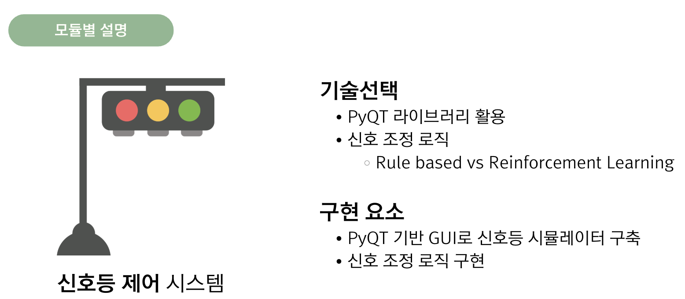
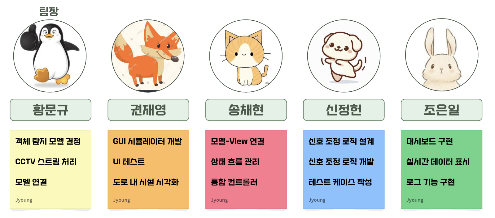

# Flexible Traffic System
### SW Pilot 파이썬 과정 파이썬 5팀
* AI 기반의 유동적인 신호등 시스템을 구축을 목표로 하는 프로젝트

## 구성
### 차량 감지 시스템

* YOLO 모델을 활용한 자동차 객체 탐지 시스템

### 교통량 데이터 집계 및 해석

* 이후 각 시스템 처리를 위한 데이터 전처리 과정

### 신호등 제어 시스템

* 탐지된 교통량을 기반으로 신호등 제어, PyQT 활용한 GUI 시뮬레이터 구현

### 시각화 및 로그 시스템

* 트래픽 대시보드 구현하여 실시간 교통량 확인

## 팀원 역할

